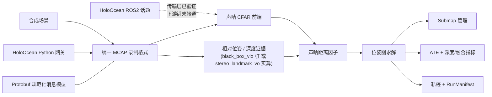
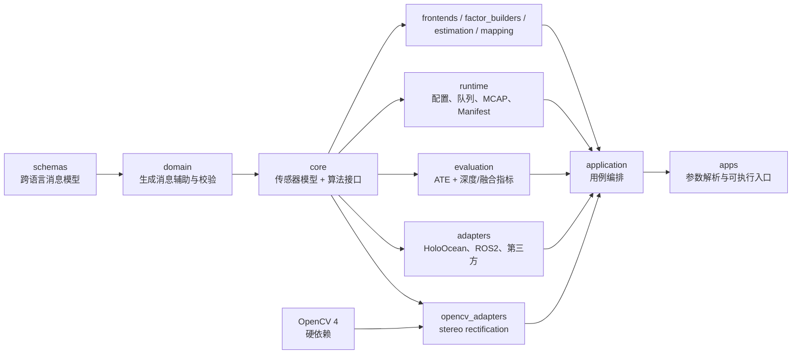

# uw_slam

> 面向水下自主平台的声学—光学融合 SLAM 工程框架

[](https://isocpp.org/)
[](https://www.python.org/)
[](https://docs.ros.org/en/jazzy/)
[](./LICENSE)

`uw_slam` 把水下 SLAM 中的核心消息与接口、传感器前端、因子构建、状态估计、地图管理、
仿真/ROS2 接入和评测拆成可独立演进的模块。跨语言数据统一使用 Protobuf，录制与
回放统一使用 MCAP，算法核心不依赖 ROS2 或 HoloOcean。

当前仓库处于“架构骨架 + 可运行端到端链路”阶段：合成数据可以完整经过
`声呐/光学前端 → 因子图 → 位姿估计 → 地图 → 轨迹评测`，并有确定性回放测试保护。
它还不是生产可部署的完整声光融合系统：光学前端（稠密深度、立体特征点 VO）和声光
关联/后验深度融合已有可运行实现；一份真实 HoloOcean 双目录制也已完成离线 VO 回放，
但求解器尚未收敛到可作为基准的水平。实时 ROS2/UE5 多传感器闭环、真实声呐融合和
生产级精度/稳定性验证仍在后续范围内。

## 导航

- [核心能力](#核心能力)
- [快速开始](#快速开始)
- [运行端到端 Demo](#运行端到端-demo)
- [架构](#架构)
- [开发指南](#开发指南)
- [配置与外部接入](#配置与外部接入)
- [参与开发](#参与开发)
- [已知边界](#已知边界)
- [许可证与代码出处](#许可证与代码出处)

## 核心能力

| 能力 | 当前实现 | 状态 |
|---|---|---|
| 核心消息与接口 | Protobuf 提供跨语言规范化消息模型，定义观测、量测证据、因子、状态、地图、健康状态和标定；`measurement_api` 提供算法接口 | 已实现并有跨模块 round-trip 测试 |
| 声呐前端 | CFAR 检测、极坐标转换、DBSCAN 聚类 | 已实现并有固定 fixture 回归测试 |
| 因子构建 | 相对位姿、深度、声呐距离因子，声呐残差含解析雅可比 | 已实现并有数值验证 |
| 光学相对位姿 | 立体特征点 VO：blob/Harris 检测 + NCC 匹配 + RANSAC 刚体拟合，从左右相机帧实时算相对位姿；RANSAC 拟合附带数值 SE(3) 协方差，白化进 relative-pose 因子 | 已实现并接入 Demo（`estimator_mode: stereo_landmark_vo`），可替代默认的 ground-truth+noise 桩 `black_box_vio`；跟踪失败按 `max_consecutive_failures` 计入健康状态（HEALTHY/SUSPECT/UNAVAILABLE），单帧失败不丢失参考 keyframe |
| 声光深度融合 | 声呐弧投影、跨模态关联、后验深度优化、局部点云数据交接 | 已实现九场景矩阵；CTest 强制执行最低有效覆盖 gate，质量收益与延迟 gate 仍为 opt-in；地图证据按 `contribution_mask` 区分 optical-only / acoustic-optic 两类点数，`acoustic_optic_demo.yaml` 对后者设了非零 gate |
| 状态估计 | Eigen 实现的 Gauss-Newton/LM 位姿图求解器 | 已实现；后端接口可替换 |
| 地图与评测 | `SubmapManager`；ATE、深度/融合和点云 Chamfer/completeness/outlier/F-score 指标 | ATE/深度/融合已用于现有验证；点云指标已有 API/单测但尚未接 Demo 或门禁；尚无 RPE |
| 可复现实验 | 四层 YAML 配置、不可变 `RunManifest`、确定性 MCAP 回放 | Manifest 已写 git/config/标定 hash、平台、seed 和起止时间；完整数据/依赖 provenance 仍待补齐 |
| 仿真接入 | HoloOcean Python 网关、统一 MCAP 格式录制、相机标定 | 已在原生 Windows HoloOcean 2.3.0 录制真实双目 bag 并离线回放；当前 Linux 开发机未重新运行仿真器 |
| ROS2 接入 | HoloOcean ImagingSonar 桥接节点 | 可编译、可独立启动；下游管线尚未接通 |

主要技术栈：

| 范围 | 技术 |
|---|---|
| 算法与运行时 | C++17、Eigen、yaml-cpp、OpenCV 4（硬依赖，经 `opencv_adapters` 边界接入 stereo rectification） |
| 核心消息与接口 | Protobuf、`measurement_api` |
| 录制与回放 | MCAP |
| 仿真适配 | Python 3.10+、HoloOcean |
| 中间件适配 | ROS2 Jazzy（可选构建） |
| 构建与验证 | CMake 3.22+、CTest、GoogleTest、pytest |

## 快速开始

以下流程不需要 ROS2、HoloOcean 或 Unreal Engine。它会构建项目、运行 C++/Python
测试、检查依赖规则、生成合成 MCAP，并运行回放 Demo。

### 1. 准备环境

推荐 Linux 开发环境。基础依赖包括：

- CMake 3.22+、支持 C++17 的 GCC；
- Eigen3、Protobuf/`protoc`、GoogleTest、yaml-cpp、OpenCV 4（`core`、`calib3d`、`imgproc`）；
- Python 3.10+、`venv` 和 `pip`；
- 首次配置时可访问网络，以获取 MCAP C++ SDK。

仓库提供了 apt 优先、conda-forge 回退的安装助手：

```bash
./tools/setup_dev_env.sh
```

如果脚本使用 conda 回退路径，请按其输出把 `uw_slam_build` 环境的 `bin` 目录
加入 `PATH`。yaml-cpp 不在该脚本当前的自动安装列表中，系统缺少它时需通过 apt
安装 `libyaml-cpp-dev`，或用下面的命令补全 conda 构建环境；该示例保留现有依赖并
显式安装新的 OpenCV 硬依赖。conda-forge 上不加版本号的 `opencv` 已解析到 5.x，
与 `find_package(OpenCV 4 REQUIRED ...)` 不兼容，必须显式钉住 `opencv=4.*`：

```bash
conda install -n uw_slam_build -c conda-forge \
  eigen libprotobuf protobuf gtest yaml-cpp "opencv=4.*" cmake
```

### 2. 一键验证

```bash
tools/verify_pipeline.sh --out-dir /tmp/uw_slam_verify/readme_smoke
cat /tmp/uw_slam_verify/readme_smoke/summary.txt
```

验证目录会保存每一步的命令、日志、耗时和状态，并产出：

| 产物 | 内容 |
|---|---|
| `summary.txt` | 构建、测试、lint、数据生成和回放结果 |
| `synthetic.mcap` | 带 ground truth 的合成观测 |
| `demo_trajectory.tum` | TUM 格式估计轨迹 |
| `demo_run_manifest.json` | 本次运行实际使用的配置与版本信息 |

2026-08-23 对当前工作树的实跑包含 275 个 CTest 测试（按用例展开）和 50 个 Python
测试，全部通过；默认合成回放 ATE RMSE 为 `0.0665821 m`（12 个匹配位姿）。数字会随
模块增加而变化，`summary.txt` 和实际测试命令才是最终依据。

## 运行端到端 Demo

希望逐步调试时，可以手动执行同一条管线。

### 构建

使用系统依赖：

```bash
cmake -S . -B build
cmake --build build -j"$(nproc)"
```

使用 `uw_slam_build` conda 环境：

```bash
export PATH="$HOME/miniconda3/envs/uw_slam_build/bin:$PATH"
cmake -S . -B build \
  -DCMAKE_PREFIX_PATH="$HOME/miniconda3/envs/uw_slam_build"
cmake --build build -j"$(nproc)"
```

### 生成数据并回放

```bash
build/bin/synth_bag_gen \
  --experiment configs/experiment/synthetic_smoke.yaml \
  --out /tmp/synthetic.mcap

build/bin/replay_demo \
  --bag /tmp/synthetic.mcap \
  --experiment configs/experiment/synthetic_smoke.yaml \
  --out /tmp/demo

cat /tmp/demo_trajectory.tum
```

在默认合成场景中，求解器通常在 6–7 次迭代内收敛，ATE RMSE 约为
0.06–0.07 m；不同 seed 会产生波动，这不是验收阈值。声呐只有距离而没有仰角，
且当前版本不联合优化路标，首次观测的 elevation 误差会影响 x/y 估计。算法与
误差来源详见[代码库参考文档](./docs/uw-slam-codebase-reference-2026-08-18.md)。

命令行参数会覆盖 `--experiment` 中的同名配置，适合快速做单变量试验。把
`--experiment` 换成 `configs/experiment/synthetic_smoke_vo.yaml` 可以跑同一场景
的 `estimator_mode: stereo_landmark_vo` 变体——相对位姿因子改由
`stereo_landmark_vo_frontend` 从合成的左右相机帧实时计算，而不是从 bag 里读取
`synth_bag_gen` 写入的 ground-truth+noise 证据；ATE 量级与默认桩相当（约
0.06 m）。

仓库还提供 `configs/experiment/acoustic_optic_demo.yaml`，用同一条 `synth_bag_gen`/
`replay_demo` 管线跑一个声光目标真正落在相机窄视场内的场景
（`configs/scenario/acoustic_optic_demo.yaml`），产出真实的 `ACCEPTED` 声光关联，
并开启 `min_acoustic_optic_accepted`/`min_acoustic_optic_map_points` 两个非零 gate
（seed 42 实测 12 个 keyframe 中 3 个 accepted / 3 个 acoustic-optic map point）；默认
`synthetic_smoke.yaml` 的三个目标不在相机视场内，这两个 gate 保持关闭，见
[配置说明](./configs/README.md) 的「P0 非放空 gate」一节。

仓库还提供 `configs/experiment/real_holoocean_vo.yaml`，用于回放已有的真实 HoloOcean
双目录制。当前审计样本约 76 MB、50 个 keyframe，不含声呐/IMU/DVL；2026-08-23 复核实测
产出 46 条 VO 相对位姿、47 个 keyframe，对齐后 ATE RMSE 为 `4.32138 m`，求解器 30 次
迭代后仍 `stalled`——一般 stereo rectification 接入 `replay_demo` 后这条真实数据路径
的数字明显变差（此前是 49 条/50 个 keyframe、ATE `0.5596 m`）。根因已定位到具体机制但
未修复：这台真实机体左右相机的标定基线不是纯 y 轴平移（见
`configs/rig/example_auv_real_camera.yaml` 头部注释，x/z 分量占基线量级的 15-17%），
`cv::stereoRectify` 为了让两个虚拟相机满足行对齐（row-epipolar）约束，必须对两个相机
施加一个不小的旋转，这个旋转把 left 相机的主点从标定值 `cx≈256`（图像中心）搬到了
`cx≈170`——用 `alpha=-1`（更保守的缩放/裁切）复核过，`cx` 分毫不差还是 170.043，
证明这个偏移完全来自旋转本身，跟 `alpha`/裁切策略无关，也不是实现 bug。
`stereo_landmark_vo_frontend` 的 Harris 角点检测/时序匹配/RANSAC 只在近乎平行基线的
合成数据上验证过，在这组主点大幅偏移、需要真实旋转对齐的真实标定上表现变差——跟
`camera_rectifier`（`include/sensor_models/camera_rectifier.hpp`）此前因双线性重采样
削弱纹理、被搁置不接入 `replay_demo` 的已知风险是同一类问题，需要后续联合调参才能
恢复，不在这次改动范围内，详见
[生产就绪度路线图 2.4 节](./docs/uw-slam-production-readiness-and-roadmap-2026-08-21.md#24-真实-holoocean-录制回放)
的复核记录。这证明录制数据能进入离线 VO 管线，不代表真实重建或实时闭环已经跑通，
当前数字也不应被当作"变好了"。

## 架构

### 数据流



### 依赖方向



依赖只允许从左向右（`domain → core → {frontends, factor_builders, estimation,
mapping, runtime, evaluation, adapters, opencv_adapters} → application → apps`）。`include/`、`src/` 下的生产
代码不能包含 ROS2、HoloOcean 或第三方 vendor 头文件，也不能使用旧的手写 `uw/...`
include 路径。OpenCV 4 现在是构建硬依赖，`opencv2/...` 头与 OpenCV 类型只允许出现在
`adapters/opencv/`（lint 角色名 `opencv_adapters`）边界内——`opencv_adapters::
StereoRectificationContext`（`include/opencv_adapters/stereo_rectifier.hpp` +
`src/opencv_adapters/stereo_rectifier.cpp`）已实现并接入 `apps/replay_demo`，支持
任意 plumb-bob 畸变、不同内参、非平行/非水平的一般离轴 stereo rig，产出 rectified
images 和带新 `calibration_version` 的 derived `RigCalibrationSnapshot`——不止是
平行双目假设下的恒等快速路径。`tools/lint/check_no_ros_in_core.sh`（实际实现在
`tools/lint/check_layer_dependencies.py`）会强制检查这一点。Protobuf schema 是
C++ 与 Python 跨语言规范化消息模型的唯一来源。

### Live/Replay 统一输入主链

`RunReplayPipeline`（`apps/replay_demo`）不再对同一个 MCAP 文件按 topic 多次
`ReadMcapMessages<T>` 扫描、也不再用 `capture_time / 0.2s` 反推 `kfN` 关键帧
id——一次 `uw::runtime::McapEventSource` 顺序扫描（按 `logTime` 排序，未知
topic/schema 不匹配/payload 解析失败都计入 `EventSourceReport`，不会静默丢失）
把 bag 拆成规范化的 `uw::runtime::CanonicalEvent`，经
`uw::application::PumpEvents` 分发进 `PipelineInputPort`；`replay_demo` 用的
实现是 `ReplayInputAccumulator`（`include/application/replay_input_accumulator.hpp`），
身份只认 wire 里的 `ObservationId`/`MeasurementEvidence.source_observations`，
空 id、`(sensor_id, observation_id)` 重复、evidence 引用不存在的 source
observation 都进 `ReplayInputDiagnostics` 并使整个 run 以非零退出码失败，
而不是被悄悄吞掉。

这套 `EventSource`/`PipelineInputPort` 接口本身与来源无关——`tests/integration/
event_source_parity_test.cpp` 验证同一批事件经 MCAP 与内存两种 `EventSource`
注入，应用侧观察到的顺序完全一致，这是它已经可靠的证明，不是"实时调度已经
接通"的证明。**已完成**：规范事件契约（`CanonicalEvent`/`canonical_topics.hpp`）、
单次 MCAP `EventSource`、与来源无关的 `PipelineInputPort`/`PumpEvents`、
`replay_demo` 输入阶段的迁移。**尚未完成**（下一实施包起点）：供应商 SDK 的
`EventSource` 实现、有界队列/背压调度、Start/Stop/Drain 生命周期、异步
recorder tap、HMI presentation adapter。新代码不允许绕过 `PipelineInputPort`
直接用 `ReadMcapMessages<T>`/vendor SDK 消息喂给算法层——`ReadMcapMessages<T>`
本身仍保留给 `bag_audit` 等评测/审计工具用，但不再是 replay 主链的入口。

### 仓库结构

| 目录 | 职责 |
|---|---|
| `schemas/proto/` | 跨语言规范化消息模型和 C++/Python 代码生成输入 |
| `include/`、`src/` | 手写 C++ 公共头文件与实现，按角色分区（`domain`、`sensor_models`、`measurement_api`、`frontends`、`factor_builders`、`estimation`、`mapping`、`runtime`、`evaluation`、`adapters`、`application`） |
| `apps/` | `synth_bag_gen`、`replay_demo` 等参数解析与可执行入口源码；可复用算法和用例编排分别位于对应层与 `application` 层 |
| `tests/` | 消息格式与接口一致性（`contracts/`）、按层单元测试和确定性回放（`integration/`） |
| `cmake/` | 集中式 CMake：`Dependencies.cmake`、`Libraries.cmake`、`Applications.cmake`、`Tests.cmake` |
| `adapters/` | HoloOcean（Python）、ROS2、数据集与第三方系统边界文档 |
| `baselines/` | 外部基线（如 `sonar_camera_reconstruction`）运行脚本，不链接进本仓库构建 |
| `configs/` | `defaults → rig → scenario → experiment` 分层配置 |
| `tools/` | 环境安装、代码生成、lint 和完整验证脚本 |
| `external_repos/` | 只读参考/移植来源，不纳入本仓库版本控制 |

## 开发指南

### C++ 测试

```bash
cmake --build build -j"$(nproc)"
ctest --test-dir build --output-on-failure
```

测试分为三层：

- **消息格式与接口一致性测试**（CTest 标签仍为 `contract.*`，源码在 `tests/contracts/`）：验证 Protobuf round-trip 和模块边界；
- **单元测试**（`unit.<layer>.*`，源码按层放在 `tests/{core,frontends,factor_builders,estimation,mapping,runtime,evaluation,adapters}/`）：验证前端、因子雅可比、求解器、地图、运行时和评测；
- **集成/回放测试**（`integration.*`，源码在 `tests/integration/`）：同一 bag/config/seed 运行两次，输出必须逐字节一致。

### Python 适配器测试

```bash
python3 -m venv adapters/holoocean/.venv
adapters/holoocean/.venv/bin/pip install -e "./adapters/holoocean[dev]"
adapters/holoocean/.venv/bin/python -m pytest adapters/holoocean/tests
```

如果修改了 Protobuf schema，先重新生成 Python 绑定：

```bash
tools/codegen/gen_py.sh
```

### 架构约束检查

```bash
tools/lint/check_no_ros_in_core.sh
```

提交改动前，推荐直接运行完整验证：

```bash
tools/verify_pipeline.sh
```

额外质量检查使用独立构建目录，不会覆盖普通 `build/`：

```bash
tools/run_quality_checks.sh sanitizer       # ASan + UBSan，全量 CTest
tools/run_quality_checks.sh coverage        # gcov 摘要；目前只报告、不设覆盖率门槛
tools/run_quality_checks.sh static-analysis # cppcheck；未安装时跳过，目前不作为失败 gate
```

TSan 可通过 `-DUW_SANITIZER=thread` 手动构建，但当前预编译 protobuf/gtest 未插桩会
产生已知假阳性，因此尚未接入 CI。

未显式指定 `--out-dir` 时，日志写入
`${TMPDIR:-/tmp}/uw_slam_verify/<timestamp>/`。

## 配置与外部接入

### 分层配置

配置按以下顺序合并：

```text
defaults → rig → scenario → experiment → 显式 CLI 参数
```

| 层 | 描述内容 |
|---|---|
| `defaults/` | 平台默认求解器、因子信息和运行时参数 |
| `rig/` | 具体载体的传感器内外参与噪声模型 |
| `scenario/` | world、控制、退化、故障和随机 seed |
| `experiment/` | 前端、估计器、可靠性策略、地图后端和算力预算 |

`synth_bag_gen` 与 `replay_demo` 已消费 rig/scenario/defaults 的主要字段。
`replay_demo` 会按 `estimator_mode` 和 `frontends.landmark_detector` 选择 VO 路径与
检测器；`frontends.sonar`、`frontends.optical`、`map_backend` 目前各只有一个实现，
但未知值会在启动时失败，不会静默按硬编码管线继续运行。字段说明与路径解析规则见
[配置文档](./configs/README.md)。

### HoloOcean Python 网关

`adapters/holoocean/` 可以把 HoloOcean 观测写成与 C++ 回放程序一致的
MCAP/Protobuf 格式。坐标变换、确定性随机化、时间语义和统一格式写入器已有
测试；录制入口与相机标定工具已在原生 Windows HoloOcean 2.3.0 上用于生成真实双目
bag。本仓库所在 Linux 开发机没有 HoloOcean/UE5 环境，`HoloOceanSession` 的完整可靠性
和实时多传感器录制仍未形成自动化回归。

安装和代码生成步骤见 [HoloOcean 适配器文档](./adapters/holoocean/README.md)。

### ROS2 Jazzy

ROS2 默认不参与构建。启用 `-DUW_BUILD_ROS2=ON` 前，需要：

- 已 source 的 ROS2 Jazzy 环境；
- 在独立 colcon workspace 中构建
  `external_repos/holoocean-ros/holoocean_interfaces`；
- 将该 workspace 的安装目录加入 `CMAKE_PREFIX_PATH`。

`holoocean_sonar_bridge_node` 已对真实 ROS2 Jazzy 和
`holoocean_interfaces` 完成编译、链接与独立启动验证，但没有连接真实
`holoocean_main`/UE5 数据流，也没有接入 `replay_demo` 下游。

完整环境说明见 [ROS2 适配器文档](./adapters/ros2/README.md) 和
[外部仓库说明](./external_repos/README.md)。

## 参与开发

在提交修改前，请遵守这些项目不变量：

1. **不要修改 `external_repos/` 的子仓库。** 它们是只读参考和移植来源。
2. **保持单向依赖。** `domain → core → {frontends, factor_builders, estimation,
   mapping, runtime, evaluation, adapters, opencv_adapters} → application → apps`。
3. **先改 schema。** 新增跨语言规范化消息字段时修改 `schemas/proto/`，不要在 C++ 与
   Python 中维护两套平行结构。
4. **保留代码出处。** 移植第三方实现前先阅读 [`NOTICE`](./NOTICE)，保留版权头并
   补充来源、移植范围和有意排除的内容。
5. **保证确定性。** 随机数使用显式 seed 和局部 RNG，不使用隐藏的全局随机状态。
6. **验证完整路径。** 至少运行相关单元测试和依赖 lint；影响管线时运行
   `tools/verify_pipeline.sh`。

新增 frontend 或 factor builder 时，把头文件放进 `include/frontends/`（或
`include/factor_builders/`）、实现放进 `src/frontends/`（或
`src/factor_builders/`）、测试放进 `tests/frontends/`（或
`tests/factor_builders/`），并把新文件加进 `cmake/Libraries.cmake`/
`cmake/Tests.cmake` 中对应架构层 target 的源文件列表——这些 target 按架构层
合并，不要为单个实现新建 target 或 `CMakeLists.txt`。更多工程约定和已经踩过的
坑见 [`CLAUDE.md`](./CLAUDE.md)。

## 已知边界

- 位姿图估计（`PoseGraphProblem`/求解器/轨迹 ATE）只用声呐、相对位姿和深度证据，
  不消费稠密光学深度——声光融合的输出是并行存进 `submap_manager` 的地图证据，
  不参与位姿估计。相对位姿证据默认来自 `black_box_vio`（bag 里 ground-truth+noise
  的桩）；`estimator_mode: stereo_landmark_vo` 会改用 `stereo_landmark_vo_frontend`
  从左右相机帧实时算相对位姿（blob/Harris 检测 + NCC 匹配 + RANSAC 刚体拟合），
  但它是纯视觉里程计，不融合 IMU，也不是完整的 VIO 前端。回放管线/
  `apps/synth_bag_gen` 在 `--experiment` 加载了带相机的 rig 时，会真正构造并跑
  `StereoOpticalDepthFrontend`/`SonarCfarFrontend`/`AcousticOpticDepthFusionFrontend`
  （详见代码库参考文档 6.12 节，含真实跑出来的数字）；不传 `--experiment`（或 rig
  没有相机）时两个 app 行为逐字节不变。
- ROS2 HoloOcean 桥接节点的传输层可构建和启动，但尚未经过真实仿真数据流验证，
  也未连接 `SonarFrontend`。
- SVIn 的非 ROS2 provider 具有注入点单元测试；ROS2 wrapper 仍是文档骨架，未编译。
- `estimator_mode` 与 `landmark_detector` 已驱动真实分支；sonar/optical frontend 和 map
  backend 目前仍各只有一个受支持标识符，配置校验只能 fail-fast，尚无第二实现可切换。
- `opencv_adapters::StereoRectificationContext` 已实现并接入 `replay_demo`：一般离轴
  stereo rig（不同内参、任意 plumb-bob 畸变、非平行/非水平外参）在进入
  `StereoOpticalDepthFrontend`/`StereoLandmarkVoFrontend` 前会被 rectify，frontend 只
  消费 rectified images + derived rig，不再自己假设平行双目几何。
- `include/sensor_models/camera_rectifier.hpp` 的 `CameraRectifier` 是另一个更早、更
  局限的原语（只做平行双目假设下同一相机的逐目 plumb-bob 去畸变，不做双目对齐），
  仍未接入 `replay_demo`。在现有真实 bag 上直接启用它会因重采样削弱纹理而降低 VO
  跟踪率（50/50 降到 8/50），仍需联合调参和数据回归——`replay_demo` 现在用的一般
  rectification 走的是上面 `opencv_adapters` 的独立实现，不依赖这个原语。
- 当前求解器只提供 Eigen Gauss-Newton/LM，Ceres/GTSAM 后端属于延后决策。
- 位姿图只优化 keyframe，不联合优化路标；声呐 elevation 初值不会被后续因子精化。
- reliability 多路信息上限目前只实现固定常数，尚未实现完整的自适应策略。
- 公共数据集 adapter 仍是接口规划，尚未转换真实数据集。

## 许可证与代码出处

本项目采用 [GNU GPL v3](./LICENSE)。整体使用 GPLv3，是因为声呐距离因子的部分残差
公式移植自 GPLv3 的 SVIn。声呐 CFAR 前端的部分实现来自 MIT 许可的
`sonar_camera_reconstruction`。

每一处移植的文件、上游版本、保留内容和有意排除的内容均记录在
[`NOTICE`](./NOTICE)。使用或继续移植这些实现前，请先核对该文件。

## 延伸阅读

建议按任务选择文档：

| 想了解的内容 | 文档 |
|---|---|
| 不确定应该先读哪份文档 | [文档中心](./docs/README.md) |
| 作为新贡献者第一次读代码、理清调用链 | [新人上手指南](./docs/uw-slam-newcomer-guide.md) |
| 长期模块边界、状态机、可靠性和 Gate 设计 | [声光 SLAM 平台架构](./docs/acoustic-optic-slam-platform-architecture-2026-08-17.md) |
| 当前代码里实际存在的类型、算法和数据流 | [代码库参考](./docs/uw-slam-codebase-reference-2026-08-18.md) |
| 第一阶段工程方案及既有代码审计 | [HoloOcean 到声光 SLAM 管线](./docs/holoocean-to-acoustic-optic-slam-pipeline-2026-08-05.md) |
| 配置字段与覆盖关系 | [配置说明](./configs/README.md) |
| HoloOcean Python 入口 | [HoloOcean 适配器](./adapters/holoocean/README.md) |
| ROS2 构建与验证边界 | [ROS2 适配器](./adapters/ros2/README.md) |
| 外部参考仓库的拉取与角色 | [外部仓库说明](./external_repos/README.md) |
| 移植许可证与 provenance | [NOTICE](./NOTICE) |
| 仓库开发约定与工程陷阱 | [CLAUDE.md](./CLAUDE.md) |
