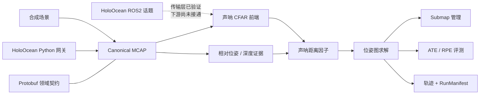
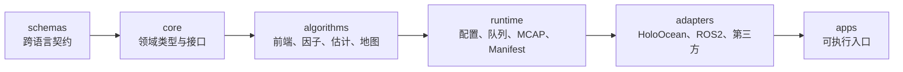

# uw_slam

> 面向水下自主平台的声学—光学融合 SLAM 工程框架

[](https://isocpp.org/)
[](https://www.python.org/)
[](https://docs.ros.org/en/jazzy/)
[](./LICENSE)

`uw_slam` 把水下 SLAM 中的数据契约、传感器前端、因子构建、状态估计、地图管理、
仿真/ROS2 接入和评测拆成可独立演进的模块。跨语言数据统一使用 Protobuf，录制与
回放统一使用 MCAP，算法核心不依赖 ROS2 或 HoloOcean。

当前仓库处于“架构骨架 + 可运行垂直切片”阶段：合成数据可以完整经过
`声呐前端 → 因子图 → 位姿估计 → 地图 → 轨迹评测`，并有确定性回放测试保护。
它还不是生产可部署的完整声光融合系统；光学前端、实时多传感器闭环和真实
HoloOcean 数据流仍在后续范围内。

## 导航

- [核心能力](#核心能力)
- [快速开始](#快速开始)
- [运行端到端 Demo](#运行端到端-demo)
- [架构](#架构)
- [开发指南](#开发指南)
- [配置与外部接入](#配置与外部接入)
- [参与开发](#参与开发)
- [已知边界](#已知边界)
- [许可证与代码出处](#许可证与代码出处)

## 核心能力

| 能力 | 当前实现 | 状态 |
|---|---|---|
| 领域契约 | Protobuf 定义观测、量测证据、因子、状态、地图、健康状态和标定 | 已实现并有跨模块 round-trip 测试 |
| 声呐前端 | CFAR 检测、极坐标转换、DBSCAN 聚类 | 已实现并有固定 fixture 回归测试 |
| 因子构建 | 相对位姿、深度、声呐距离因子，声呐残差含解析雅可比 | 已实现并有数值验证 |
| 状态估计 | Eigen 实现的 Gauss-Newton/LM 位姿图求解器 | 已实现；后端接口可替换 |
| 地图与评测 | `SubmapManager`、ATE/RPE 轨迹指标 | 已实现并接入 Demo |
| 可复现实验 | 四层 YAML 配置、不可变 `RunManifest`、确定性 MCAP 回放 | 已实现 |
| 仿真接入 | HoloOcean Python 网关、canonical MCAP 读写 | 转换与写入逻辑已测试；未连接本机真实仿真器 |
| ROS2 接入 | HoloOcean ImagingSonar 桥接节点 | 可编译、可独立启动；下游管线尚未接通 |

主要技术栈：

| 范围 | 技术 |
|---|---|
| 算法与运行时 | C++17、Eigen、yaml-cpp |
| 数据契约 | Protobuf |
| 录制与回放 | MCAP |
| 仿真适配 | Python 3.10+、HoloOcean |
| 中间件适配 | ROS2 Jazzy（可选构建） |
| 构建与验证 | CMake 3.22+、CTest、GoogleTest、pytest |

## 快速开始

以下流程不需要 ROS2、HoloOcean 或 Unreal Engine。它会构建项目、运行 C++/Python
测试、检查依赖规则、生成合成 MCAP，并运行回放 Demo。

### 1. 准备环境

推荐 Linux 开发环境。基础依赖包括：

- CMake 3.22+、支持 C++17 的 GCC；
- Eigen3、Protobuf/`protoc`、GoogleTest、yaml-cpp；
- Python 3.10+、`venv` 和 `pip`；
- 首次配置时可访问网络，以获取 MCAP C++ SDK。

仓库提供了 apt 优先、conda-forge 回退的安装助手：

```bash
./tools/setup_dev_env.sh
```

如果脚本使用 conda 回退路径，请按其输出把 `uw_slam_build` 环境的 `bin` 目录
加入 `PATH`。yaml-cpp 不在该脚本当前的自动安装列表中，系统缺少它时需通过 apt
安装 `libyaml-cpp-dev`，或在构建环境中安装 `yaml-cpp`。

### 2. 一键验证

```bash
tools/verify_pipeline.sh --out-dir /tmp/uw_slam_verify/readme_smoke
cat /tmp/uw_slam_verify/readme_smoke/summary.txt
```

验证目录会保存每一步的命令、日志、耗时和状态，并产出：

| 产物 | 内容 |
|---|---|
| `summary.txt` | 构建、测试、lint、数据生成和回放结果 |
| `synthetic.mcap` | 带 ground truth 的合成观测 |
| `demo_trajectory.tum` | TUM 格式估计轨迹 |
| `demo_run_manifest.json` | 本次运行实际使用的配置与版本信息 |

当前工作区验证面包含 14 个 CTest 测试和 9 个 Python 测试。数字会随模块增加而变化，
`summary.txt` 和实际测试命令才是最终依据。

## 运行端到端 Demo

希望逐步调试时，可以手动执行同一条管线。

### 构建

使用系统依赖：

```bash
cmake -S . -B build
cmake --build build -j"$(nproc)"
```

使用 `uw_slam_build` conda 环境：

```bash
export PATH="$HOME/miniconda3/envs/uw_slam_build/bin:$PATH"
cmake -S . -B build \
  -DCMAKE_PREFIX_PATH="$HOME/miniconda3/envs/uw_slam_build"
cmake --build build -j"$(nproc)"
```

### 生成数据并回放

```bash
build/apps/tools/synth_bag_gen/synth_bag_gen \
  --experiment configs/experiment/synthetic_smoke.yaml \
  --out /tmp/synthetic.mcap

build/apps/replay_demo/replay_demo \
  --bag /tmp/synthetic.mcap \
  --experiment configs/experiment/synthetic_smoke.yaml \
  --out /tmp/demo

cat /tmp/demo_trajectory.tum
```

在默认合成场景中，求解器通常在 6–7 次迭代内收敛，ATE RMSE 约为
0.15–0.22 m；不同 seed 会产生波动，这不是验收阈值。声呐只有距离而没有仰角，
且当前版本不联合优化路标，首次观测的 elevation 误差会影响 x/y 估计。算法与
误差来源详见[代码库参考文档](./docs/uw-slam-codebase-reference-2026-08-18.md)。

命令行参数会覆盖 `--experiment` 中的同名配置，适合快速做单变量试验。

## 架构

### 数据流



### 依赖方向



依赖只允许从左向右。特别是 `core/` 和 `algorithms/` 不能包含 ROS2、
HoloOcean 或第三方 vendor 头文件；`tools/lint/check_no_ros_in_core.sh` 会强制
检查这一点。Protobuf schema 是 C++ 与 Python 的唯一跨语言事实源。

### 仓库结构

| 目录 | 职责 |
|---|---|
| `schemas/proto/` | 领域契约和 C++/Python 代码生成输入 |
| `core/` | 领域类型、`Pose3`、传感器模型、前端/因子抽象 |
| `algorithms/` | 声呐前端、因子构建、估计与子图地图 |
| `runtime/` | MCAP I/O、配置、状态机、队列和 RunManifest |
| `adapters/` | HoloOcean、ROS2、数据集与第三方系统边界 |
| `apps/` | `synth_bag_gen` 和 `replay_demo` |
| `configs/` | `defaults → rig → scenario → experiment` 分层配置 |
| `evaluation/` | ATE/RPE 等轨迹指标 |
| `tests/` | L0 契约和 L2 确定性回放；L1 测试随模块放置 |
| `tools/` | 环境安装、代码生成、lint 和完整验证脚本 |
| `external_repos/` | 只读参考/移植来源，不纳入本仓库版本控制 |

## 开发指南

### C++ 测试

```bash
cmake --build build -j"$(nproc)"
ctest --test-dir build --output-on-failure
```

测试分为三层：

- **L0 契约测试**：验证 Protobuf round-trip 和模块边界；
- **L1 模块测试**：验证前端、因子雅可比、求解器、地图、运行时和评测；
- **L2 回放测试**：同一 bag/config/seed 运行两次，输出必须逐字节一致。

### Python 适配器测试

```bash
python3 -m venv adapters/holoocean/.venv
adapters/holoocean/.venv/bin/pip install -e "./adapters/holoocean[dev]"
adapters/holoocean/.venv/bin/python -m pytest adapters/holoocean/tests
```

如果修改了 Protobuf schema，先重新生成 Python 绑定：

```bash
tools/codegen/gen_py.sh
```

### 架构约束检查

```bash
tools/lint/check_no_ros_in_core.sh
```

提交改动前，推荐直接运行完整验证：

```bash
tools/verify_pipeline.sh
```

未显式指定 `--out-dir` 时，日志写入
`${TMPDIR:-/tmp}/uw_slam_verify/<timestamp>/`。

## 配置与外部接入

### 分层配置

配置按以下顺序合并：

```text
defaults → rig → scenario → experiment → 显式 CLI 参数
```

| 层 | 描述内容 |
|---|---|
| `defaults/` | 平台默认求解器、因子信息和运行时参数 |
| `rig/` | 具体载体的传感器内外参与噪声模型 |
| `scenario/` | world、控制、退化、故障和随机 seed |
| `experiment/` | 前端、估计器、可靠性策略、地图后端和算力预算 |

`synth_bag_gen` 与 `replay_demo` 已消费 rig/scenario/defaults 的主要字段；算法变体
选择目前会被解析和打印，但尚未驱动不同实现分支。字段说明与路径解析规则见
[配置文档](./configs/README.md)。

### HoloOcean Python 网关

`adapters/holoocean/` 可以把 HoloOcean 观测写成与 C++ 回放程序一致的
MCAP/Protobuf 格式。坐标变换、确定性随机化、时间语义和 canonical writer 已有
测试；实际 `HoloOceanSession` 仍需安装仿真器后在目标机器上验证。

安装和代码生成步骤见 [HoloOcean 适配器文档](./adapters/holoocean/README.md)。

### ROS2 Jazzy

ROS2 默认不参与构建。启用 `-DUW_BUILD_ROS2=ON` 前，需要：

- 已 source 的 ROS2 Jazzy 环境；
- 在独立 colcon workspace 中构建
  `external_repos/holoocean-ros/holoocean_interfaces`；
- 将该 workspace 的安装目录加入 `CMAKE_PREFIX_PATH`。

`uw_holoocean_sonar_bridge_node` 已对真实 ROS2 Jazzy 和
`holoocean_interfaces` 完成编译、链接与独立启动验证，但没有连接真实
`holoocean_main`/UE5 数据流，也没有接入 `replay_demo` 下游。

完整环境说明见 [ROS2 适配器文档](./adapters/ros2/README.md) 和
[外部仓库说明](./external_repos/README.md)。

## 参与开发

在提交修改前，请遵守这些项目不变量：

1. **不要修改 `external_repos/` 的子仓库。** 它们是只读参考和移植来源。
2. **保持单向依赖。** `core → algorithms → runtime → adapters → apps`。
3. **先改 schema。** 新增跨语言领域字段时修改 `schemas/proto/`，不要在 C++ 与
   Python 中维护两套平行结构。
4. **保留代码出处。** 移植第三方实现前先阅读 [`NOTICE`](./NOTICE)，保留版权头并
   补充来源、移植范围和有意排除的内容。
5. **保证确定性。** 随机数使用显式 seed 和局部 RNG，不使用隐藏的全局随机状态。
6. **验证完整路径。** 至少运行相关单元测试和依赖 lint；影响管线时运行
   `tools/verify_pipeline.sh`。

新增 frontend 或 factor builder 时，沿用现有模块的独立
`CMakeLists.txt + include/src/test` 结构。更多工程约定和已经踩过的坑见
[`CLAUDE.md`](./CLAUDE.md)。

## 已知边界

- 位姿图估计（`PoseGraphProblem`/求解器/轨迹 ATE）只用声呐、相对位姿和深度证据，
  没有 VIO 前端，也不消费稠密光学深度——声光融合的输出是并行存进 `submap_manager`
  的地图证据，不参与位姿估计。`apps/replay_demo`/`apps/tools/synth_bag_gen` 在
  `--experiment` 加载了带相机的 rig 时，会真正构造并跑
  `StereoOpticalDepthFrontend`/`SonarCfarFrontend`/`AcousticOpticDepthFusionFrontend`
  （详见代码库参考文档 6.12 节，含真实跑出来的数字）；不传 `--experiment`（或 rig
  没有相机）时两个 app 行为逐字节不变。
- ROS2 HoloOcean 桥接节点的传输层可构建和启动，但尚未经过真实仿真数据流验证，
  也未连接 `SonarFrontend`。
- SVIn 的非 ROS2 provider 具有注入点单元测试；ROS2 wrapper 仍是文档骨架，未编译。
- `experiment` 中的 frontend、estimator 和 map backend 选择字段尚未真正切换实现。
- 当前求解器只提供 Eigen Gauss-Newton/LM，Ceres/GTSAM 后端属于延后决策。
- 位姿图只优化 keyframe，不联合优化路标；声呐 elevation 初值不会被后续因子精化。
- reliability 多路信息上限目前只实现固定常数，尚未实现完整的自适应策略。
- 公共数据集 adapter 仍是接口规划，尚未转换真实数据集。

## 许可证与代码出处

本项目采用 [GNU GPL v3](./LICENSE)。整体使用 GPLv3，是因为声呐距离因子的部分残差
公式移植自 GPLv3 的 SVIn。声呐 CFAR 前端的部分实现来自 MIT 许可的
`sonar_camera_reconstruction`。

每一处移植的文件、上游版本、保留内容和有意排除的内容均记录在
[`NOTICE`](./NOTICE)。使用或继续移植这些实现前，请先核对该文件。

## 延伸阅读

建议按任务选择文档：

| 想了解的内容 | 文档 |
|---|---|
| 不确定应该先读哪份文档 | [文档中心](./docs/README.md) |
| 长期模块边界、状态机、可靠性和 Gate 设计 | [声光 SLAM 平台架构](./docs/acoustic-optic-slam-platform-architecture-2026-08-17.md) |
| 当前代码里实际存在的类型、算法和数据流 | [代码库参考](./docs/uw-slam-codebase-reference-2026-08-18.md) |
| 第一阶段工程方案及既有代码审计 | [HoloOcean 到声光 SLAM 管线](./docs/holoocean-to-acoustic-optic-slam-pipeline-2026-08-05.md) |
| 配置字段与覆盖关系 | [配置说明](./configs/README.md) |
| HoloOcean Python 入口 | [HoloOcean 适配器](./adapters/holoocean/README.md) |
| ROS2 构建与验证边界 | [ROS2 适配器](./adapters/ros2/README.md) |
| 外部参考仓库的拉取与角色 | [外部仓库说明](./external_repos/README.md) |
| 移植许可证与 provenance | [NOTICE](./NOTICE) |
| 仓库开发约定与工程陷阱 | [CLAUDE.md](./CLAUDE.md) |
