# 文档图示化候选清单（画图思路与草稿）

> **这份文档是什么**：`docs/architecture.png` 补上了"全局一张图"之后，本文继续盘点
> README 和 `docs/` 下**还有哪些段落值得配图**，并把每张图的**画图思路和图的内容**
> 直接以 Mermaid 草稿（或画法说明）保存下来，让后来者可以直接粘贴进目标文档，
> 而不必重新推敲一遍"这段到底该怎么画"。
>
> **当前状态（2026-09-04）**：**15 条候选已全部落地到目标文档**，本文从"待办清单"
> 转为"图的设计说明书"——记录每张图**为什么这么画、依据哪个文件、当初否掉了哪些画法**。
> 改图之前先读这里对应的条目，别只看目标文档里的成品。
>
> **新增候选时怎么用**：读下面的"判断标准"确认收益 → 写清"核对来源" → 落地后在总表
> 里补一行。
>
> **核对基准**：当前工作树，2026-09-04（最新提交 `6e8eb11`）。草稿里的阈值、容量、
> 顺序都标了来源文件；改代码时这些图要一起改，改不动就删图——**一张过时的图比没有
> 图更贵**。

## 判断标准：什么值得画，什么不值得

仓库文档已经很密，加图不是越多越好。本文只收满足下面**至少一条**的段落：

1. **结构是二维的，但文字是一维的**——依赖关系、分层叠加、并行状态机。读者要在脑子
   里重建拓扑，读三遍才记住。
2. **顺序敏感且顺序本身是设计决策**——优先级链、门链、校验链。表格能列出条目，但
   表达不了"第一个命中者生效"和"为什么是这个顺序"。
3. **时间轴语义**——预积分区间、staleness 判定、发布节流。文字里的"区间""过期"
   "间隔"三个词指的是不同的时间跨度，画出来一眼分清。
4. **有踩坑记录的地方**——`z` 轴 anchor、RNG 拆流、camera↔body 共轭。这些坑的共同
   点是"想当然的图和真实的图不一样"，画出真实的那张就是最好的防复发手段。

**明确不画**（省得后来者重复提）：

- 纯枚举型内容（配置字段清单、术语表、目录结构表）——表格已经是最优表达。
- 已经有代码即文档的内容（`canonical_topics.hpp` 的话题词表）——图会立刻漂移。
- 数学推导（预积分递推、Fuse 的加权融合公式）——公式块比框图准确得多，画成框图
  只会丢信息。
- 路线图里的人力/排期分配——变化频率远高于文档更新频率。

## 候选总表

| # | 图 | 落地位置 | 图型 | 优先级 | 状态 |
|---|---|---|---|---|---|
| D1 | 四层配置叠加与三个驱动分支的选择器 | `README.md` §分层配置、`configs/README.md` 开头 | flowchart | P0 | 已落地 → [README §分层配置](../README.md#分层配置) |
| D2 | `LiveEventSource` 校验链 + 四车道 + 加权轮转 | ROV 实时深度走读 §5、`README.md` §Live/Replay 统一输入主链 | flowchart | P0 | 已落地 → [实时深度走读 §5](./uw-slam-rov-realtime-closed-loop-deep-dive-2026-08-28.md) |
| D3 | 降级判定优先级链 `ComputeDegradation` | ROV 实时深度走读 §6.6 | flowchart | P0 | 已落地 → [实时深度走读 §6.6](./uw-slam-rov-realtime-closed-loop-deep-dive-2026-08-28.md) |
| D4 | 三个正交状态机 | 长期架构 §12.1 | stateDiagram ×3 | P0 | 已落地 → [长期架构 §12.1](./acoustic-optic-slam-platform-architecture-2026-08-17.md) |
| D5 | 跨模态关联门链 `TargetAssociator` | ROV 实时深度走读 §7.2 | flowchart | P0 | 已落地 → [实时深度走读 §7.2](./uw-slam-rov-realtime-closed-loop-deep-dive-2026-08-28.md) |
| D6 | IMU 预积分时间轴：静止预卷 / 关键帧边界 / gap | IMU 预积分设计短文 §2–§3 | ASCII 时间轴 + flowchart | P0 | 已落地 → [IMU 预积分设计 §2–§3](./imu-preintegration-design-2026-09-03.md) |
| D7 | 因子图拓扑与 `kf0` 的 z anchor | 离线深度走读 §9–§10、`CLAUDE.md` 坑条目 | graph | P1 | 已落地 → [离线深度走读 §9.2](./uw-slam-offline-slam-pipeline-deep-dive-2026-08-28.md) |
| D8 | 声呐 CFAR 前端流水线 | 离线深度走读 §7、技术剖析 §1.2 | flowchart | P1 | 已落地 → [离线深度走读 §7.1](./uw-slam-offline-slam-pipeline-deep-dive-2026-08-28.md) |
| D9 | 一条 bag 的旅程（带文件名的阶段泳道） | 离线深度走读 §0 | flowchart | P1 | 已落地 → [离线深度走读 §0](./uw-slam-offline-slam-pipeline-deep-dive-2026-08-28.md) |
| D10 | 四档 gate profile 与种子战役判定 | ROV 实时深度走读 §11、测试指南 | flowchart | P1 | 已落地 → [实时深度走读 §11](./uw-slam-rov-realtime-closed-loop-deep-dive-2026-08-28.md) |
| D11 | 验证顺序与"本机能跑 / 跑不了"的分界 | 测试与验证指南 §先跑一键验证 | flowchart | P1 | 已落地 → [测试与验证指南](./testing-and-verification-guide-2026-08-20.md) |
| D12 | PREP 跨工作包任务级依赖（6 包 43 项） | 到货前准备工作规格 §9 | flowchart | P2 | 已落地 → [到货前准备工作规格 §9](./ROV平台到货前准备工作规格-2026-09-02.md) |
| D13 | 一年阶段门与三层交付边界 | 落地路线图 §3/§6 | timeline | P2 | 已落地 → [落地路线图 §6](./ROV平台落地路线图.md) |
| D14 | 坐标系与符号约定（`depth_m` 双语义、camera↔body 共轭） | `README.md` 或 `CLAUDE.md` 附近 | **手绘 SVG，非 Mermaid** | P2 | 已落地 → [frames-and-sign-conventions.svg](./frames-and-sign-conventions.svg) |
| D15 | 文档路由图 | `docs/README.md` | flowchart | P2 | 已落地 → [docs/README.md](./README.md) |

---

## D1 四层配置叠加与三个驱动分支的选择器

**为什么值得画**：`defaults → rig → scenario → experiment` 是叠加关系，而
`estimator_mode` / `landmark_detector` / `estimation.solver` 是**分支**关系——两种关系
现在混在同一段文字和两张表里，读者最常见的误解是"配置字段都会切换实现"。图把
"叠加"和"分支"分成两块画，顺带把"只有一个受支持实现、写错就启动失败"这条 fail-fast
语义放进同一张图。

**核对来源**：`src/runtime/config.cpp:748`（三个 `estimator_mode`）、
`include/runtime/config.hpp`、`configs/README.md`。

> ⚠️ **顺带修一个已漂移的事实**：`README.md` 的选择器表只列了 `black_box_vio` /
> `stereo_landmark_vo`，但 `ValidateExperimentConfigSelections` 从 PREP-B-01 起已接受
> 第三个值 `imu_preintegration`（`src/runtime/config.cpp:750`）。画这张图时一并补上。

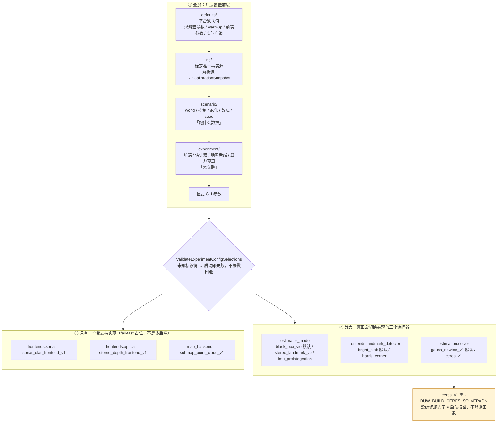

**放置建议**：`README.md` 现有那张"层 → 描述内容"表之前；`configs/README.md` 开头第一
段之后。两处放同一张图即可，不必各画一张。

---

## D2 `LiveEventSource`：校验链 + 四车道 + 加权轮转

**为什么值得画**：这是主线二里唯一"顺序、容量、策略三者都必须同时记住"的组件。现在
文字用了一个表（车道）+ 一个 ASCII 链（校验）+ 三条 bullet（调度），读者很难把
"IMU 用 kReject 显式背压"和"加权轮转 8:4:2:1"这两件事联系成同一个设计意图：
**优先级既体现在丢弃策略上，也体现在调度配额上**。

**核对来源**：`src/runtime/live_event_source.cpp:17`（15 槽轮转表，实测
localization ×8 / correction ×4 / mapping ×2 / evidence ×1）、
`include/runtime/bounded_queue.hpp:118`（车道语义注释）、ROV 实时深度走读 §5。

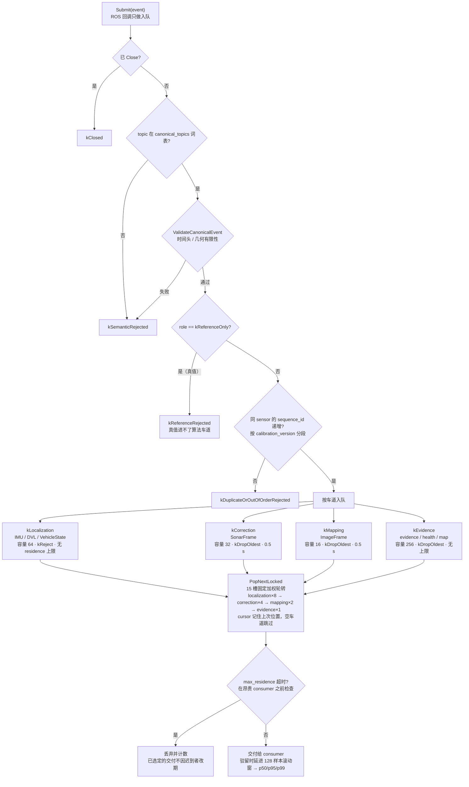

**放置建议**：ROV 实时深度走读 §5 开头，替代那段 ASCII 校验链（保留表格，表格里的
数字仍是权威）。`README.md` §Live/Replay 统一输入主链可以只放**下半段**（车道 +
轮转），校验链细节留给深度走读。

---

## D3 降级判定优先级链 `ComputeDegradation`

**为什么值得画**：现在是一张九行的优先级表。表格的问题是它**长得像状态机但不是**——
`ComputeDegradation` 每次发布都从头重算一遍，没有状态记忆（唯一的记忆是
`recovering_` 标志），把它画成 `stateDiagram` 会误导读者去找"转移条件"。正确画法是
**自上而下的短路判定链**，每个出口同时标出 `status` / `reason` / `guidance_valid`
三元组——尤其要让 `guidance_valid=false` 的三个出口视觉上区分开，因为那是"HMI 上
辅助信息必须停止使用"的分界线。

**核对来源**：`src/application/online_assist_pipeline.cpp:374-411`（逐条复核过，顺序
与文档表一致）。视觉排在声呐前是代码注释里明确写的刻意决定，图上要标出来。

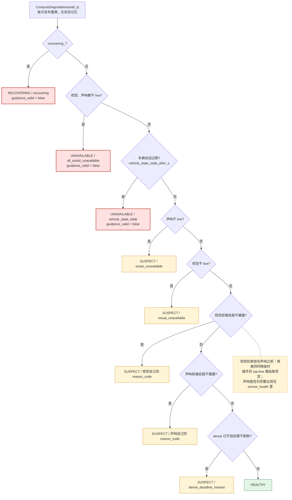

**配套小图**（同一节，画 `recovering_` 的两个触发源语义差异，这是 FUS-HEALTH-002 最容易
读错的地方）：

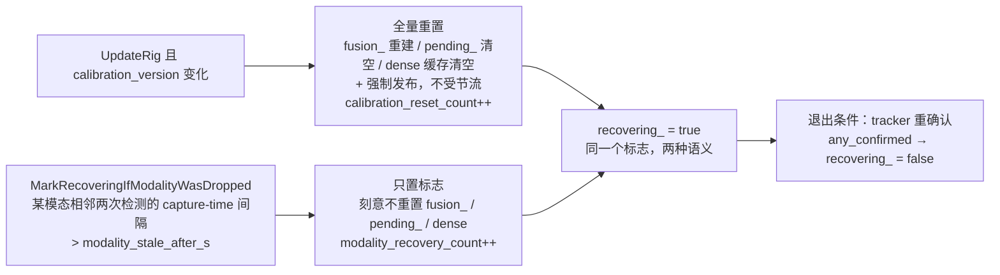

---

## D4 三个正交状态机

**为什么值得画**：架构 §12.1 只给了系统状态机的 ASCII 图，modality 和 mapping 两个
状态机各只有一句话。而这一节的核心论点恰恰是**三者正交**——"建图状态不得直接决定
定位状态"。三张并排的图把"正交"这件事画出来，比一句话有效得多。

**核对来源**：`docs/acoustic-optic-slam-platform-architecture-2026-08-17.md` §12.1。

> ⚠️ **一处待确认**：原 ASCII 图是一条单向链（`TRACKING → DEGRADED → LOST →
> RELOCALIZING → RECOVERING → TRACKING`），字面上意味着"一旦 DEGRADED 就必须走完
> LOST 和 RELOCALIZING 才能回到 TRACKING"。这大概率不是本意（DEGRADED 恢复应能直接
> 回 TRACKING），但**不要在画图时替架构文档决定**——草稿里把这条回边画成虚线并标
> `待确认`，落地前找架构负责人拍板，顺便把结论写回 §12.1 文字。

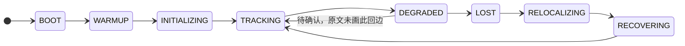

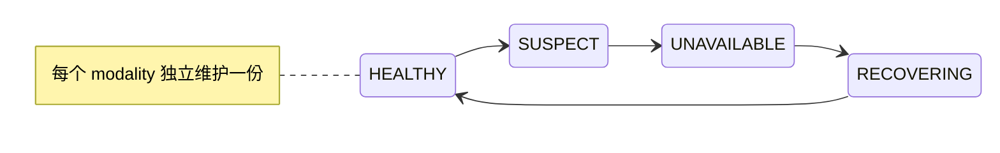

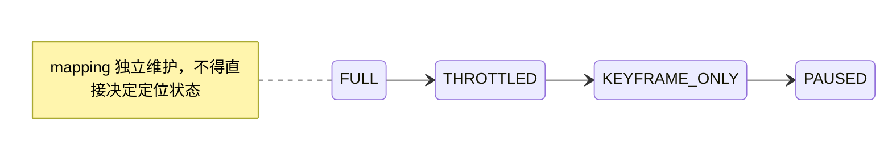

图下面保留原文那句约束，它是这三张图真正的规范内容：**状态转换必须使用时间窗口、
不同的进入/退出阈值、最小保持时间、reason code 和触发证据**，避免在阈值附近震荡。

---

## D5 跨模态关联门链 `TargetAssociator`

**为什么值得画**：五道门 + 一个分叉（双方带 range vs 仅声呐带 range）+ 每道门自己的
诊断码，纯文字读下来很难记住"哪一步失败会得到哪个 `AssociationReason`"。而排障时
恰恰是**从诊断码倒查是哪道门**。图按"门 → 出口诊断码"组织，正好是排障的查阅方向。

**核对来源**：`include/frontends/target_associator.hpp`、
`src/frontends/target_associator.cpp`，阈值见 ROV 实时深度走读 §7.2。

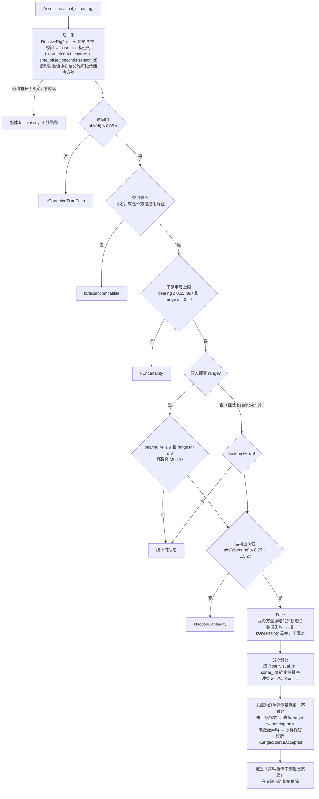

---

## D6 IMU 预积分时间轴：静止预卷 / 关键帧边界 / gap

**为什么值得画**：这一节里"区间""间隔""保持段"是三个不同的时间跨度，而它们的
拒绝规则又互相独立：区间长度门（1 ms–5 s）、单个保持段门（`max_sample_gap_s`
默认 50 ms）、样本数下限（`min_samples` 默认 2）。文字表格能列出规则，但列不出
"这三个跨度分别指时间轴上的哪一段"。**这里刻意不用 Mermaid**——时间轴用等宽 ASCII
更准确，也不会在渲染器之间漂移。

**核对来源**：`docs/imu-preintegration-design-2026-09-03.md` §2/§3/§7/§8、
`include/frontends/imu_preintegration_frontend.hpp`、`include/sensor_models/imu_preintegration.hpp`。

```text
                静止预卷 ≥ 0.5 s                    关键帧区间 i→j
     |<--------------------------->|<------------------------------------>|
IMU  ●●●●●●●●●●●●●●●●●●●●●●●●●●●●●●●●●●●●●●●●●●●●●●●●●●   ●●●●●●●●●●●●●●●●
     200 Hz                        ↑                    ↑  ↑             ↑
                                   |                    |__|             |
                          /keyframe/boundary            保持段 > 50 ms   /keyframe/boundary
                          header.capture_time =         → imu_gap_too_large  (下一个边界)
                          唯一的预积分边界时间             整条边被拒，不插值补桥

     静止判据（连续保持 ≥ 0.5 s）：|‖a‖ − g| < 0.05 m/s² 且 ‖ω‖ < 0.01 rad/s
     通过 → v₀ = 0；bg₀ = 静止段陀螺均值；ba₀ = 静止段平均比力 − 重力方向预测比力
            三者由独立惯性先验残差约束，不把整个惯性块固定
     失败 → v₀ = 0 但施加宽先验 σ_v = 0.5 m/s，
            并把 initialization = wide_velocity_prior 写进运行诊断
            （「初值为零」≠「已知为零」）

     区间长度门：≤ 1 ms 或 > 5 s → interval_out_of_range
     样本数门  ：< min_samples(2) → too_few_imu_samples
     连续失败 ≥ 3 次 → Health() = STATUS_UNAVAILABLE
```

配一张 fail-closed 判定链（放在 §3 那张表旁边，表给阈值，图给顺序和后果）：

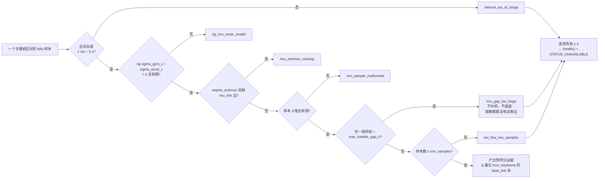

---

## D7 因子图拓扑与 `kf0` 的 z anchor

**为什么值得画**：`CLAUDE.md` 里"z 轴不是规范自由度"那条坑，本质是一张拓扑图的问题：
`kf0` 被固定，但它固定在哪个 z 上，取决于图里有没有 depth 边。文字解释了两遍仍然
绕；一张标出"哪些节点被 depth 边约束、anchor 的 z 从哪来"的图，能让后来者在**加新的
绝对参考因子（例如 PREP-B-02 的绝对航向）时立刻看出同类陷阱**。

**核对来源**：离线深度走读 §9.2/§10.1、`include/estimation/pose_graph_problem.hpp`、
`CLAUDE.md` 坑条目。

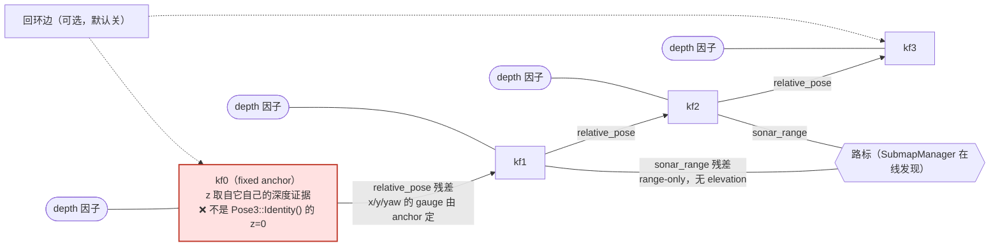

图注要写清那条结论：**x/y/yaw 对"相对位姿 + range-only"确实是 gauge freedom，但只要
图里有 depth 边，z 就有了绝对参考**；把 anchor 钉在 z=0 会与其他 keyframe 的 depth
证据冲突，症状是 30 次迭代不收敛、ATE 4.6 m，而且**单元测试全绿**。

---

## D8 声呐 CFAR 前端流水线

**为什么值得画**：CFAR → 极坐标转换 → DBSCAN → extent 自适应 sigma 是一条固定
流水线，而且每一步都有"移植时刻意没搬过来的部分"（`merge.py` 丢 pitch、直接烘焙到
`map` frame）。图上把"移植边界"标成一条竖线，比在正文里重复三次"前端只输出声呐局部
系证据"更省事。

**核对来源**：`src/frontends/{cfar_detector,dbscan,sonar_cfar_frontend}.cpp`、
离线深度走读 §7、`NOTICE` 的移植说明。

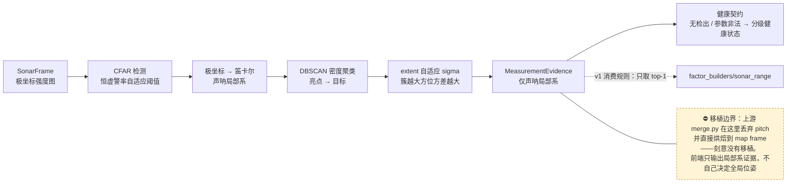

---

## D9 一条 bag 的旅程（带文件名的阶段泳道）

**为什么值得画**：`README.md` 的离线数据流图是**概念级**的（框里写的是角色名）。离线
深度走读 §0 需要的是**文件级**的同一条链——读者在 §0 决定"我要跳到第几节"，靠的就是
"这一步在哪个文件里"。两张图分工明确，不重复。

**核对来源**：离线深度走读 §0–§13 各节标题里的文件路径。

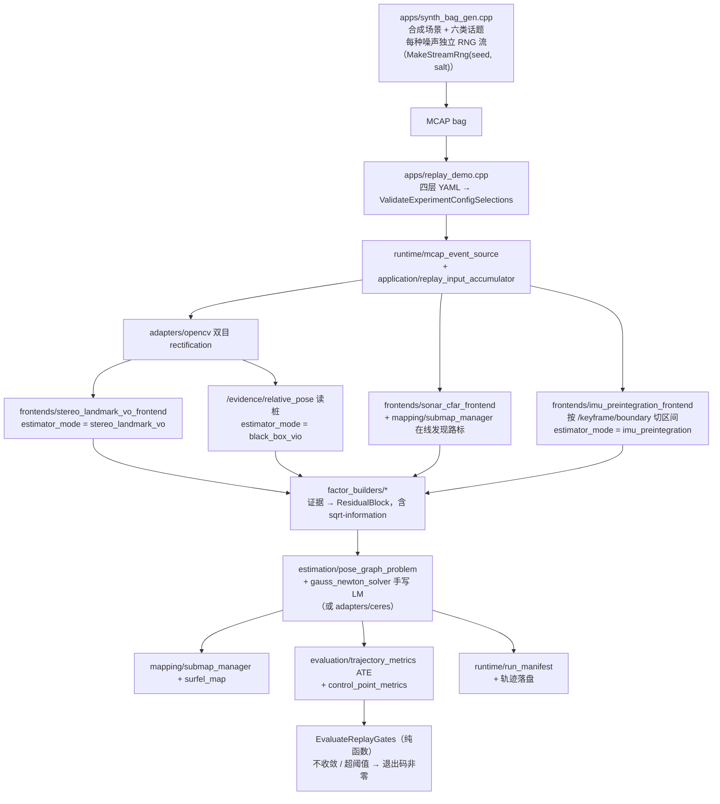

---

## D10 四档 gate profile 与种子战役判定

**为什么值得画**：四个 profile + 两个"种子战役"通过率 + "本机跑不了"这件事，现在分散
在深度走读 §11、测试指南和 traceability CSV 三处。一张图把**判定逻辑**（单次 soak vs
10 seed 战役）和**执行前提**（需要真 HoloOcean/GPU/ROS2 原生主机）放在一起，正好回答
读者最常问的那个问题："我在这台机器上能跑到哪一档？"

**核对来源**：`adapters/holoocean/uw_holoocean_adapter/{realtime_gate,run_report}.py`、
ROV 实时深度走读 §11。

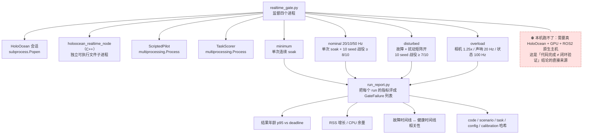

---

## D11 验证顺序与"本机能跑 / 跑不了"的分界

**为什么值得画**：`CLAUDE.md` 规定的验证顺序（编译 → C++ 测试 → Python 测试 → lint →
**实跑 demo**）和测试指南里"目前测不了的部分"是同一件事的两面。图把它们画成一条主
链 + 一条被截断的支链，同时把"实跑 demo 抓到过、单测抓不到"的三个历史 bug 标在主链
末端——那是这张图真正想传达的东西：**最后一步不能省**。

**核对来源**：`CLAUDE.md` §构建与测试、测试与验证指南、`tools/run_quality_checks.sh`。

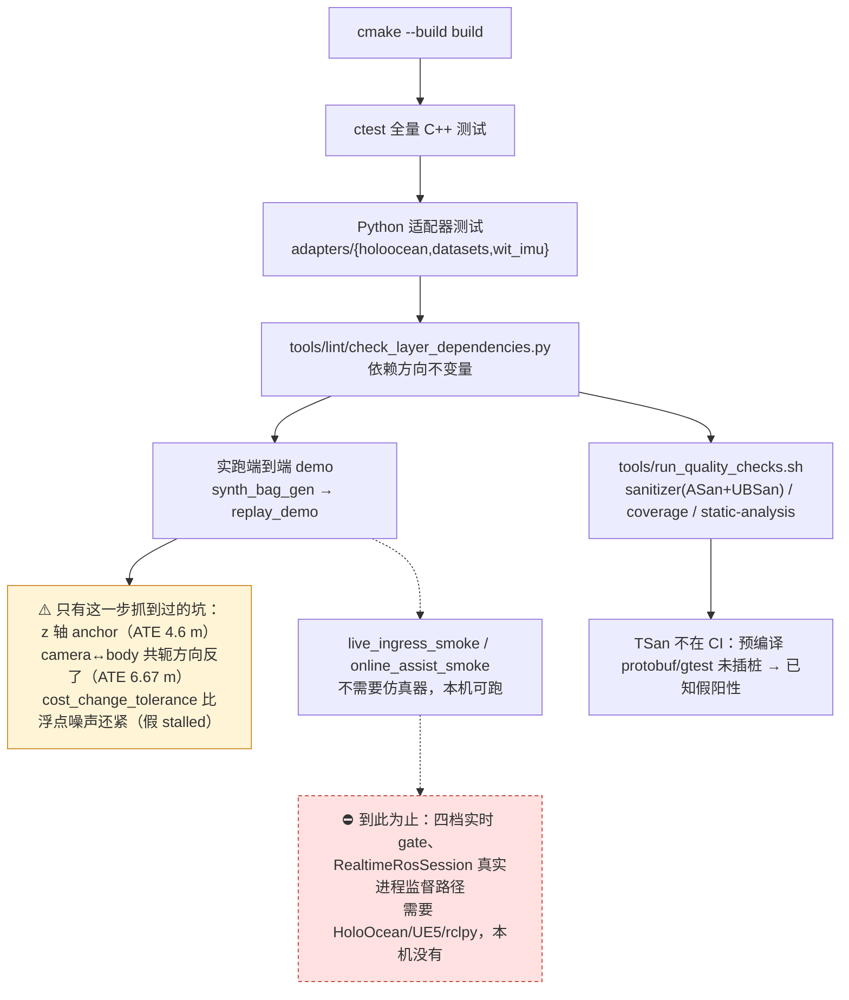

---

## D12 PREP 跨工作包任务级依赖

**为什么值得画**：43 个任务、六个工作包，现在是一份线性的规格文档。真正影响排期决策
的是**跨包依赖**（例如 PREP-D 的 IMU 数据链是 PREP-B-01 预积分在真机上的前提；
PREP-A-13 设备伪装层是 PREP-B/C 能在仿真里预演的前提），而这些依赖散落在各任务的
"前置"描述里。

**为什么标 P2 且草稿未完成**：包间依赖需要先从 34 条任务描述里逐条抽出来核对，抽错
了会误导排期——这件事**不应该靠画图的人猜**。建议做法：先在规格文档里给每个 PREP
任务补一行显式 `依赖：PREP-X-YY`，再照着生成图（那时图几乎是机械转换，也不会漂移）。

骨架（先画包级，任务级等依赖补齐后再展开）：

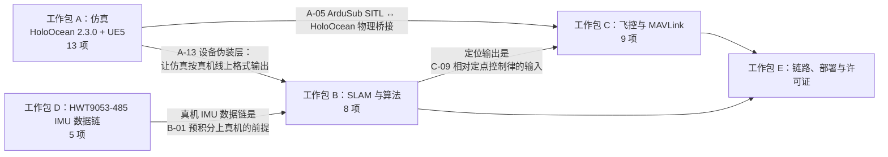

---

## D13 一年阶段门与三层交付边界

**为什么值得画**：路线图里"三层交付边界"和"一年阶段门"是两个正交维度（交付什么 vs
什么时候通过哪个门），文字里交替出现容易串。`timeline` 图型正好只表达时间顺序，不
假装表达依赖——对一份会滚动修订的路线图来说，这个"表达力不足"反而是优点：**图不会
比文字更快过时**。

**核对来源**：`docs/ROV平台落地路线图.md` §3、§6、§8。

**落地记录（2026-09-04）**：已按 §6 表格把 S0–S5 六个阶段门的名称、时间和放行条件
抄进 timeline（放行条件做了缩写，准确表述以表格为准）。下面保留最初的占位草稿，
说明为什么选 `timeline` 而不是 `gantt`：**timeline 只表达顺序、不表达依赖**，
对一份会滚动修订的路线图来说，这种"表达力不足"反而让图不会比文字更快过时。

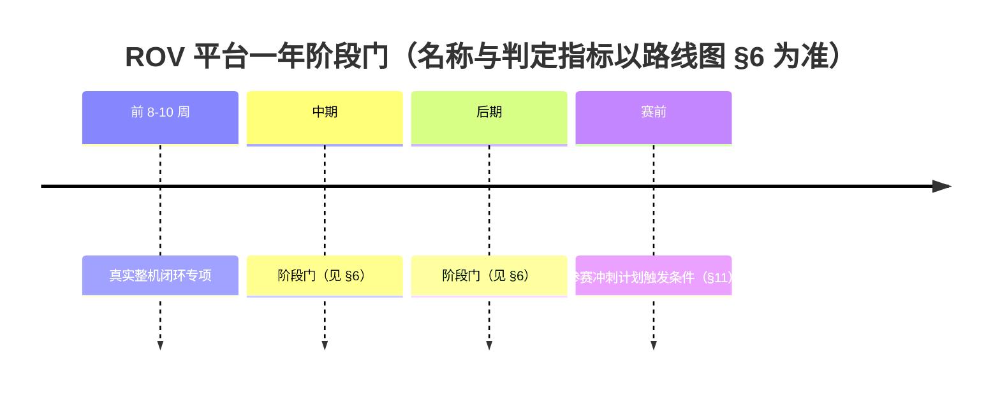

图旁边保留 §8 的量化验收指标表——**指标是规范，图只是索引**。

---

## D14 坐标系与符号约定（`depth_m` 双语义、camera↔body 共轭）

**为什么值得画**：这是全仓库最容易出错、也最不适合 Mermaid 的一类内容。两条约定：

1. `PressureDepthMeasurement.depth_m` 是**正向下**的水深；world/body 是 Z-up，所以
   位姿 `z = -depth_m`。而 `OpticalDepthPriorMeasurement` / `FusedDepthMeasurement`
   以及关联记录里的 `depth_m` 是相机 optical frame 的**正向前**距离。**同名字段、
   不同坐标与符号语义。**
2. `stereo_landmark_vo_frontend` 从相机系解出的相对位姿，要用 rig 标定的 camera→body
   外参做共轭 `T_body = T_cam_body · T_cam · T_cam_body⁻¹` 才能喂给以 body frame 定义
   的相对位姿因子。方向搞反时单测全绿、实跑 ATE 停在 6.67 m。

**落地记录（2026-09-04）**：已手写成 `docs/frames-and-sign-conventions.svg`
（README「坐标系与符号约定」+ `CLAUDE.md` 两处引用）。**画完必须渲染出来看**——
第一版分析时觉得没问题，渲染后发现标题溢出画布、`X_opt` 压住深度标注、
`T_cam_body` 跨过分隔线跑进左半张，改了三轮才收敛。本机可用
`python3 -c "import cairosvg; cairosvg.svg2png(url=..., write_to=...)"` 出图自查。

**画法说明（不要用 Mermaid）**：Mermaid 没有几何/三维表达能力，硬画只会得到一张
"框里写着坐标系名字"的假图。SVG 内容：

- 左半张：一个 Z-up 的 world/body 坐标三轴，水面在上，机体在下；标出 `depth_m` 的
  正方向箭头（向下）与位姿 `z` 的正方向箭头（向上），并把 `z = -depth_m` 写在两个
  箭头之间。
- 右半张：相机 optical frame 三轴（Z 向前），画一条从光心指向目标的射线，标注
  `depth_m`（optical 正向前）；旁边画 body frame 三轴和 `T_cam_body` 这条变换边，
  把共轭公式写在变换边上。
- 两半之间画一条竖分隔线，上面写"同名字段 `depth_m`，语义不同——不要直接混用"。

用 SVG 而非 PNG：文本可搜索、体积小（7 KB）、diff 时能看出改了什么。图里显式画了
白色底板——GitHub 深色主题下透明底 + 深色描边会整张看不见。

---

## D15 文档路由图

**为什么值得画**：`docs/README.md` 已经有一张很好的"任务 → 文档"表。图的增量价值不在
于重复这张表，而在于表达表里没有的一件事：**文档之间的权威顺序**（正式赛事规则 →
在线系统需求规格 → 两份下位规格 → 路线图/实施计划/配置/测试）。这条顺序现在只有一句
话，但它是冲突时的仲裁规则，值得画成一条单向链。

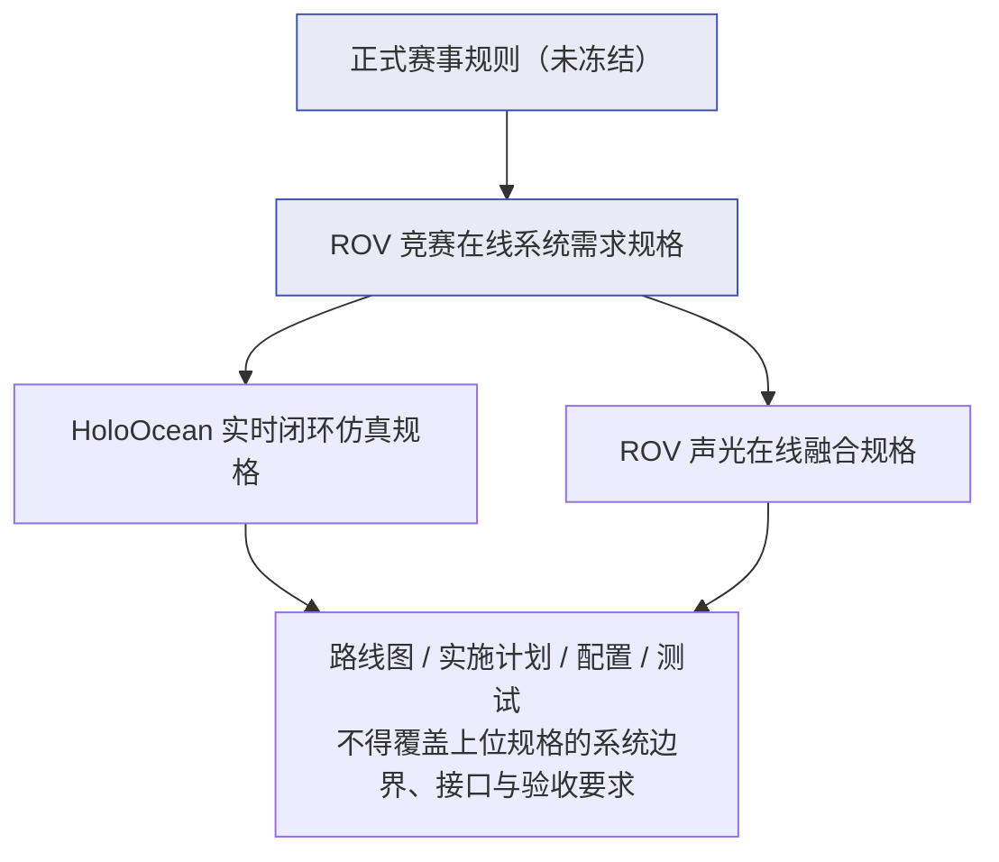

---

## 维护约定

1. **每张图必须在图注里写来源文件**（像本文每条的"核对来源"那样）。没有来源的图，
   半年后没人敢改也没人敢删。
2. **图与代码同一个 commit 改**。阈值、容量、顺序类的图尤其如此——D2/D3/D5 这三张
   图里的每个数字都能在代码里 grep 到，改了代码就必须改图。
3. **落地一张就在本文总表里更新状态并加链接**，不要让本文变成一份"永远待办"的清单。
   本文的价值在落地之后才真正显现：成品图里看不到"当初为什么不这么画"。
4. 新增候选时先过一遍上面的"判断标准"；不满足就写进"明确不画"那一节，附一句理由。
